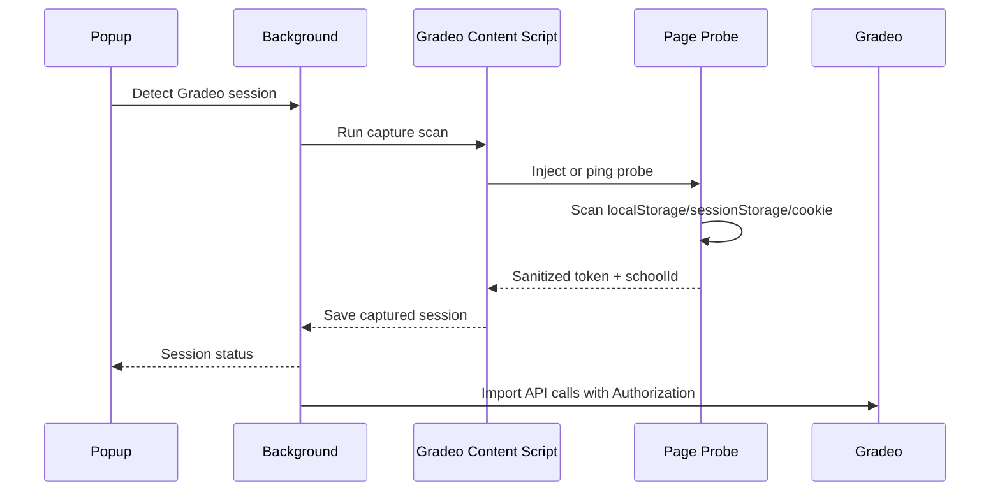

# Gradeo Token Auto-Capture Design

## Context

The Gradeo importer extension currently requires an admin to copy request headers from a live Gradeo API request and paste them into the popup. The extension then parses those headers, removes browser-controlled headers, and uses the `Authorization: Bearer ...` value plus a discovered `schoolId` to call Gradeo APIs from the background worker.

The manual request sample confirms:

- Gradeo API calls use `Authorization: Bearer REDACTED`.
- `schoolId` appears in Admin API routes such as `/api/school/v2/list/student/:schoolId`.
- `schoolId` is also available in the `admin_user_schoolId` cookie.
- The bearer token is stored in Gradeo page local storage.
- The feature must work in both Chrome and Firefox.

The design keeps the existing manual pasted-header path as a fallback and adds automatic capture for the token and school id.

## Goals

- Remove the normal need to copy headers from DevTools.
- Work in Chrome and Firefox without Chrome-only `debugger` APIs.
- Capture only the minimum Gradeo auth data the importer needs.
- Preserve the current API import flow and backend contract.
- Make token state visible in the popup without exposing the token value.
- Keep manual pasted headers available when automatic capture fails.

## Non-Goals

- Do not store Gradeo credentials or refresh tokens.
- Do not proxy Gradeo traffic through Kings Track.
- Do not add Chrome's `debugger` permission.
- Do not depend on browser-specific access to protected request headers.
- Do not expand the importer to new Gradeo routes as part of this feature.

## Recommended Approach

Use a cross-browser Gradeo page capture bridge:

1. When a Gradeo tab is open, a content script injects a page-world probe script.
2. The probe first reads Gradeo local storage for bearer-token-shaped values.
3. The probe also wraps same-origin `fetch` and `XMLHttpRequest` calls so refreshed tokens can be captured from Gradeo's own API traffic.
4. The probe posts sanitized session details back to the content script.
5. The content script forwards only `authorization`, `schoolId`, `capturedAt`, and `source` to the background worker.
6. The background worker stores the captured session in `browser.storage.local`.
7. `getGradeoApiContext()` prefers the captured session and falls back to the existing `gradeoApiHeadersJson` field.

This avoids relying on `webRequest` for `Authorization` because Chrome Manifest V3 does not reliably expose that header. It also avoids Chrome's `debugger` API so Firefox remains supported.

## Extension Components

### Manifest

Add a Gradeo session capture content script for `https://platform.gradeo.com.au/*`.

The existing `storage`, `tabs`, and Gradeo host permissions are enough for the recommended approach. Do not add `debugger`. Add `webRequest` only if later testing shows a useful Firefox-only fallback is worth the extra permission prompt.

### Page-World Probe

The injected probe runs in the Gradeo page context so it can access page-owned local storage and observe Gradeo's request construction.

Responsibilities:

- Scan `localStorage` and `sessionStorage` for JSON or string values containing a JWT-like access token.
- Prefer tokens that decode to an Auth0 issuer and a Gradeo API audience.
- Read `admin_user_schoolId` from `document.cookie`.
- Extract `schoolId` from Gradeo API URLs when present.
- Wrap `window.fetch` and `XMLHttpRequest.prototype.open/send` to inspect same-origin Gradeo API requests.
- Post only sanitized capture events to `window`.

The probe never posts cookies, trace headers, request bodies, or non-Gradeo headers.

### Content Script Bridge

The isolated content script injects the page-world probe and listens for trusted `window.postMessage` capture events from the same window.

Responsibilities:

- Validate event shape and origin.
- Normalize header casing to `Authorization`.
- Forward sanitized session data to the background worker.
- Expose a request/response message so the popup can ask an active Gradeo tab to run an immediate capture scan.

### Background Session Store

Add a stored Gradeo session object:

```json
{
  "authorization": "Bearer REDACTED",
  "schoolId": "7572b03a-1507-4309-950e-2a286bdcf0a4",
  "capturedAt": "2026-06-24T00:00:00.000Z",
  "source": "localStorage"
}
```

Implementation should keep the token value out of debug logs and popup text. Logs can include `hasAuthorization`, `schoolId`, `source`, and `capturedAt`.

### Gradeo API Context

Update `getGradeoApiContext()` to resolve context in this order:

1. Captured session with a non-empty `Authorization` and `schoolId`.
2. Existing manually pasted `gradeoApiHeadersJson`.

If a Gradeo request returns `401`, clear or mark the captured session stale and tell the user to open Gradeo so the extension can detect a fresh session.

### Popup

Replace the current headers-first readiness state with a Gradeo session state:

- `Gradeo session detected` when automatic capture has token and school id.
- `Open Gradeo to detect session` when no captured session or manual headers exist.
- `Manual headers saved` when only the fallback path is configured.

Settings should keep the manual headers textarea, but position it as a fallback rather than the primary setup step.

Add a `Detect Gradeo session` action that:

1. Finds an open `platform.gradeo.com.au` tab or opens Gradeo.
2. Asks the content script to scan local/session storage immediately.
3. Waits briefly for a capture event.
4. Refreshes popup readiness state.

## Data Flow



During normal Gradeo browsing, the probe also observes Gradeo API requests and updates the stored session when it sees a fresh bearer token or school id.

## Error Handling

- No Gradeo tab: popup asks the user to open Gradeo or opens `https://platform.gradeo.com.au/`.
- Logged out of Gradeo: popup shows `Sign in to Gradeo, then detect session`.
- Token found without school id: keep scanning and ask the user to open Admin Classes or Admin Students.
- School id found without token: keep scanning and ask the user to refresh Gradeo after sign-in.
- Expired token or `401`: mark automatic session stale and retry detection before falling back to manual headers.
- Probe injection blocked: show the manual headers fallback.
- Multiple Gradeo tabs: use the active Gradeo tab first, otherwise the most recently focused Gradeo tab.

## Security And Privacy

- Store only the bearer token and school id required for the importer.
- Never log the token, cookies, or raw request headers.
- Do not store the full copied header block for automatic captures.
- Do not send Gradeo auth data to Kings Track; use it only from the extension to call Gradeo.
- Keep manual pasted headers supported for recovery.
- Redact token values in tests and documentation.

## Testing

### Unit Tests

- Extract token from local storage strings and Auth0-style JSON payloads.
- Decode JWT payloads safely enough to rank Gradeo-looking access tokens.
- Extract `schoolId` from cookies and API URLs.
- Normalize captured session data into the background storage shape.
- Prefer captured session over manual headers in `getGradeoApiContext()`.
- Fall back to manual headers when captured session is missing or stale.
- Ensure logs and popup status never include token text.

### Browser/Extension Tests

- Chrome unpacked extension: detect session from Gradeo local storage.
- Firefox temporary extension: detect session from Gradeo local storage.
- Capture token from a mocked Gradeo `fetch` request when storage scan does not know the key.
- Capture school id from Admin Students/Admin Classes URLs.
- Import classes using a captured session.
- Confirm manual pasted headers still work.

### Manual Verification

1. Log in to Gradeo.
2. Open the extension popup and click `Detect Gradeo session`.
3. Confirm popup shows `Gradeo session detected` without showing the token.
4. Run `Sync classes`.
5. Log out and back in to Gradeo.
6. Confirm the extension refreshes the captured token after a Gradeo request or explicit detection.

## Implementation Notes

- Discover the local storage key by scanning for JWT-shaped values; do not hard-code a Gradeo storage key up front.
- Keep the automatic session object alongside `gradeoApiHeadersJson` initially to minimize migration risk.
- Defer any passive `webRequest` fallback until after testing the page probe in Chrome and Firefox.
